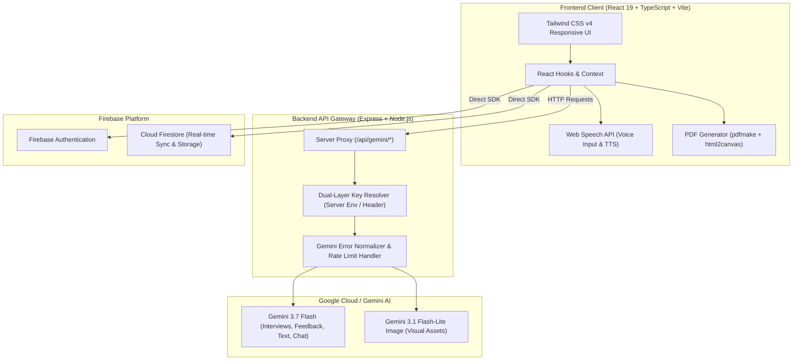

<div align="center">

# 🎓 PrepAI — AI-Powered Placement & Career Acceleration Platform

[](https://react.dev/)
[](https://www.typescriptlang.org/)
[](https://vitejs.dev/)
[](https://tailwindcss.com/)
[](https://ai.google.dev/)
[](https://firebase.google.com/)
[](./LICENSE)
[](./CONTRIBUTING.md)

<p align="center">
  <strong>Master your dream technical and behavioral interviews with real-time AI feedback, ATS resume analysis, daily streak gamification, and personalized project roadmaps.</strong>
</p>

[Explore Features](#-key-features) •
[Quick Start](#-quick-start) •
[System Architecture](#-system-architecture) •
[API Reference](#-api-reference) •
[Contributing](#-contributing)

</div>

---

## 📌 Table of Contents

- [Overview](#-overview)
- [Key Features](#-key-features)
  - [1. AI Mock Interview Simulator](#1-ai-mock-interview-simulator)
  - [2. Daily Streak Tracker & Milestone Rewards](#2-daily-streak-tracker--milestone-rewards)
  - [3. ATS Resume Analyzer & Scorecard](#3-ats-resume-analyzer--scorecard)
  - [4. Interactive ATS Resume Builder](#4-interactive-ats-resume-builder)
  - [5. AI Project Blueprint & Career Roadmap](#5-ai-project-blueprint--career-roadmap)
  - [6. Skill Gap Analyzer & Learning Pathways](#6-skill-gap-analyzer--learning-pathways)
  - [7. Story Vault & Flashcards](#7-story-vault--flashcards)
  - [8. Job Application Pipeline Tracker](#8-job-application-pipeline-tracker)
  - [9. Conversational Gemini Career Assistant](#9-conversational-gemini-career-assistant)
- [System Architecture](#-system-architecture)
- [Tech Stack](#-tech-stack)
- [Directory Structure](#-directory-structure)
- [Quick Start & Installation](#-quick-start)
- [Environment Configuration](#-environment-configuration)
- [API Reference](#-api-reference)
- [Security & API Key Architecture](#-security--api-key-architecture)
- [Contributing](#-contributing)
- [Code of Conduct](#-code-of-conduct)
- [License](#-license)

---

## 🌟 Overview

**PrepAI** is an all-in-one placement readiness platform engineered for engineering students, bootcamp graduates, and career changers. Finding a software engineering or tech role requires synchronized preparation across coding, behavioral interviews, resume tuning, and portfolio building. 

PrepAI unifies these workflows under one intelligent dashboard powered by **Google Gemini 3.7 Flash** and **Firebase Firestore**, providing real-time evaluation, actionable critiques, and gamified daily habits that guarantee interview confidence.

---

## ✨ Key Features

### 1. 🎯 AI Mock Interview Simulator
- **Multi-Persona Interviewers**: Practice with different interviewer personalities:
  - *Alex Rivers* (Senior Tech Lead — deep technical probing & edge-case scenarios)
  - *Sarah Jenkins* (Engineering Manager — system design, culture & ownership)
  - *Marcus Vance* (Executive Recruiter — behavioral, compensation, fit)
  - *Dr. Elena Rostova* (Algorithm Specialist — complexity analysis & optimal data structures)
- **Real-Time Voice & Speech Recognition**: Conduct interviews using browser microphone speech recognition with real-time transcription.
- **Deep Performance Analytics**: Evaluates response clarity, STAR method utilization, filler word counters (`um`, `like`, `basically`), tone confidence, and generates actionable, role-specific coaching tips.
- **Session History & Progress Tracking**: Review past responses, clarity scores, and trends over time.

### 2. 🔥 Daily Streak Tracker & Milestone Rewards
- **Habit-Forming Engagement**: Keeps track of daily active practice streaks with live celebration confetti and fire animations.
- **Daily Prep Checklist**: Complete high-yield daily tasks (1 Mock Interview question, 1 Flashcard drill, 1 Resume optimization, 1 Story Vault entry).
- **Streak Freeze Protection**: Built-in grace protection so busy candidates never lose hard-earned momentum.
- **Milestone Achievement Badges**:
  - ⚡ **7-Day Streak ("Week Warrior")**: Bronze Placement Shield + 250 XP bonus + STAR Method Quick Reference Perk.
  - 👑 **30-Day Streak ("Placement Master")**: Gold Master Crown + 1,200 XP bonus + Priority Gemini Coaching Mode Perk.
  - 💎 **100-Day Streak ("Diamond Centurion")**: Diamond Centurion Trophy + 5,000 XP bonus + Senior Staff Interview Simulator Perk.
- **Interactive Badge Modal & Gallery**: Inspect unlocked badges, XP rewards, and view real-time countdown progress.

### 3. 📄 ATS Resume Analyzer & Scorecard
- **Document Ingestion**: Upload PDF or image-based resumes with client-side OCR and extraction.
- **Role Fit Scoring**: Benchmark resumes against target roles (Frontend, Fullstack, AI/ML, DevOps, Data Engineering).
- **ATS Compatibility Audit**: Scans for parsing vulnerabilities, non-standard headings, missing contact links, and keyword density.
- **Tailored Improvement Plan**: Step-by-step suggestions to strengthen bullet points with quantifiable impact metrics.

### 4. 📝 Interactive ATS Resume Builder
- **Real-time Live Preview**: Split-screen editor allowing candidates to draft ATS-optimized resumes.
- **Pre-formatted Sections**: Summary, Experience, Education, Projects, Skills, and Certifications.
- **Inline Grammar & Spell Check**: Integrated spelling and grammar suggestions to eliminate typos before submission.
- **1-Click PDF Export**: Clean, machine-readable PDF generation using `pdfmake` and `html2pdf`.

### 5. 🗺️ AI Project Blueprint & Career Roadmap
- **Custom Project Architect**: Generates production-grade portfolio project specs matching candidate interests (e.g., distributed queues, AI agents, real-time collaboration).
- **Architecture Diagrams**: Automatically rendered architecture flowcharts using `mermaid`.
- **Milestone Breakdown**: Actionable phase-by-phase tasks with recommended tech stacks and GitHub repo setup tips.

### 6. 📊 Skill Gap Analyzer & Learning Pathways
- **Target Role Benchmarking**: Visual radar and bar charts mapping current skills against industry requirements.
- **Curated Learning Milestones**: Specific documentation, tutorials, and project recommendations to close identified gaps.

### 7. 📖 Story Vault & Flashcards
- **Behavioral Story Vault**: Structured STAR (Situation, Task, Action, Result) notebook to organize stories before interviews.
- **Interactive Flashcards**: Curated decks covering CS fundamentals, system design principles, networking, and behavioral dilemmas.

### 8. 💼 Job Application Pipeline Tracker
- **Kanban & Pipeline View**: Organize applications across stages: *Wishlist*, *Applied*, *Screening*, *Technical*, *Offer*, *Archived*.
- **Deadline & Interview Reminders**: Maintain interview timestamps, salary expectations, and referral contacts.

### 9. 💬 Conversational Gemini Career Assistant
- **Context-Aware Career Chat**: Powered by Google's Gemini SDK with specialized system prompts for interview prep, salary negotiation, and resume wording.
- **Streaming Responses**: Ultra-fast responses with markdown rendering and code syntax highlighting.

---

## 🏗️ System Architecture



---

## 💻 Tech Stack

| Layer | Technology | Details |
| :--- | :--- | :--- |
| **Frontend Framework** | React 19 (`react`, `react-dom`) | Modern component architecture, functional hooks |
| **Language** | TypeScript 5.8 | Strict type safety and complete interface definitions |
| **Build Tool** | Vite 6.2 | Lightning-fast HMR and optimized production bundle |
| **Styling** | Tailwind CSS v4 (`@tailwindcss/vite`) | Modern CSS-first utility classes and responsive layouts |
| **Icons** | Lucide React | High-contrast, lightweight SVG icon system |
| **Charts & Graphs** | Recharts 3.8 & Mermaid 11.14 | Interactive data visualizations & architecture diagrams |
| **Backend Framework** | Node.js + Express 4.22 | Lightweight, secure server proxying Gemini requests |
| **AI / LLM Engine** | `@google/genai` (Gemini 3.7 Flash) | Structured JSON output, system prompts, multimodal parsing |
| **Database & Auth** | Firebase 12.12 (Firestore & Auth) | Cloud persistence, user profiles, streak history |
| **PDF Generation** | `pdfmake`, `html2canvas`, `jspdf` | Pixel-perfect ATS resume exports |
| **Markdown** | `react-markdown`, `marked` | Rich text rendering for AI responses |

---

## 📁 Directory Structure

```text
prepai/
├── .github/
│   ├── workflows/
│   │   └── ci.yml               # GitHub Actions CI workflow (lint, build)
│   ├── ISSUE_TEMPLATE/
│   │   ├── bug_report.md        # Bug report template
│   │   └── feature_request.md   # Feature request template
│   └── pull_request_template.md # Standardized PR template
├── src/
│   ├── components/              # Modular UI Components
│   │   ├── ApiSettingsModal.tsx       # Dual-mode API key configuration modal
│   │   ├── CareerTools.tsx            # Salary calculator & interview tips
│   │   ├── DailyStreakTracker.tsx     # Gamified streak counter & daily checklist
│   │   ├── ErrorBoundary.tsx          # Production React error boundary
│   │   ├── GeminiChat.tsx             # Multi-turn career coaching chat
│   │   ├── Home.tsx                   # Main student dashboard & analytics
│   │   ├── InterviewPractice.tsx      # Mock interview simulator with speech AI
│   │   ├── JobTracker.tsx             # Job application Kanban pipeline
│   │   ├── LoginView.tsx              # Firebase auth login/signup screen
│   │   ├── ProjectBuilder.tsx         # Full-stack project blueprint generator
│   │   ├── Report.tsx                 # Detailed interview diagnostic reports
│   │   ├── ResumeAnalyzer.tsx         # ATS score & role-fit analyzer
│   │   ├── ResumeBuilder.tsx          # Live ATS resume builder & PDF export
│   │   ├── Sidebar.tsx                # App navigation sidebar
│   │   ├── SkillGapAnalyzer.tsx       # Tech skills benchmark tool
│   │   ├── SpellcheckTextArea.tsx     # Text area with spelling suggestions
│   │   ├── StoryVault.tsx             # STAR framework behavioral story bank
│   │   ├── StreakAchievementBadges.tsx# 7, 30, and 100-day milestone reward cards
│   │   └── UserProfile.tsx            # Candidate profile & target roles
│   ├── data/
│   │   ├── flashcards.ts        # Interview practice flashcard questions
│   │   └── personas.ts          # AI interviewer persona definitions
│   ├── lib/
│   │   ├── firebase.ts          # Firebase SDK initialization & error helpers
│   │   ├── gemini.ts            # Client-side Gemini request helper
│   │   └── streak.ts            # Streak calculation & badge definitions
│   ├── App.tsx                  # Primary application router & tab state
│   ├── index.css                # Global stylesheet & Tailwind directives
│   └── main.tsx                 # React DOM mount point
├── .env.example                 # Environment variables template
├── CHANGELOG.md                 # Project version history
├── CODE_OF_CONDUCT.md           # Community guidelines
├── CONTRIBUTING.md              # Contributor onboarding & PR standards
├── LICENSE                      # MIT License
├── package.json                 # Project dependencies & scripts
├── server.ts                    # Express server with Vite middleware proxy
├── tsconfig.json                # TypeScript compiler config
└── vite.config.ts               # Vite bundler config
```

---

## 🚀 Quick Start

### Prerequisites
- **Node.js**: `v20.x` or higher
- **npm** or **bun** / **yarn**
- **Gemini API Key**: Obtain a free API key from [Google AI Studio](https://aistudio.google.com/app/apikey)

### Installation Steps

1. **Clone the repository**:
   ```bash
   git clone https://github.com/your-username/prepai.git
   cd prepai
   ```

2. **Install dependencies**:
   ```bash
   npm install
   ```

3. **Configure Environment Variables**:
   ```bash
   cp .env.example .env
   ```
   Open `.env` and insert your Gemini API Key:
   ```env
   GEMINI_API_KEY="AIzaSyYourSecretGeminiApiKey"
   PORT=3000
   ```

4. **Start the Development Server**:
   ```bash
   npm run dev
   ```
   Open [http://localhost:3000](http://localhost:3000) in your browser.

5. **Build for Production**:
   ```bash
   npm run build
   npm start
   ```

---

## ⚙️ Environment Configuration

| Variable | Required | Default | Description |
| :--- | :---: | :---: | :--- |
| `GEMINI_API_KEY` | **Yes** | — | Google Gemini API key used for interview evaluation and analysis |
| `PORT` | No | `3000` | Port for Express API gateway and Vite dev server |
| `APP_URL` | No | `http://localhost:3000` | Base public URL of the application |
| `NODE_ENV` | No | `development` | Environment mode (`development` or `production`) |

> 💡 **User-Friendly Fallback**: If `GEMINI_API_KEY` is not present in `.env`, users can click **"API Settings"** in the app's sidebar to paste their key securely into browser local storage for individual sessions.

---

## 📡 API Reference

All AI interactions flow through the secure server proxy:

| Method | Endpoint | Description | Payload |
| :--- | :--- | :--- | :--- |
| `GET` | `/api/config/status` | Checks if server-side Gemini key is configured | None |
| `POST` | `/api/config/test-key` | Validates active Gemini API key | `{}` |
| `POST` | `/api/gemini/chat` | Multi-turn interview coaching chat | `{ messages, systemInstruction, model? }` |
| `POST` | `/api/gemini/feedback` | Strict JSON STAR & speech feedback | `{ prompt }` |
| `POST` | `/api/gemini/resume` | Multimodal resume analysis (PDF/image) | `{ fileBase64, mimeType }` |
| `POST` | `/api/gemini/text` | General prompt execution & roadmap gen | `{ prompt, systemInstruction }` |
| `POST` | `/api/gemini/image` | Generates visual diagrams or thumbnails | `{ prompt, size? }` |
| `POST` | `/api/verify-linkedin` | Checks format & accessibility of LinkedIn URL | `{ url }` |

---

## 🛡️ Security & API Key Architecture

- **No Secrets in Client Bundle**: Server-side proxy (`server.ts`) protects sensitive credentials from being exposed in browser network inspection.
- **Header Key Override (`x-gemini-key`)**: Allows demo visitors to provide custom keys safely without needing server restarts or environmental mutations.
- **Firebase Security Rules**: Granular Firestore access controls in `firestore.rules` verify user UID ownership across interview logs, resumes, and saved roadmaps.

---

## 🤝 Contributing

We welcome contributions from the community! Please read our [CONTRIBUTING.md](./CONTRIBUTING.md) for full instructions on setup, coding standards, branch conventions, and testing procedures.

1. **Fork** the repository
2. **Create a branch**: `git checkout -b feature/amazing-feature`
3. **Commit changes**: `git commit -m 'feat: add amazing feature'`
4. **Push branch**: `git push origin feature/amazing-feature`
5. **Open a Pull Request**

---

## 📜 Code of Conduct

This project adheres to the Contributor Covenant Code of Conduct. By participating, you are expected to uphold this code. Please read [CODE_OF_CONDUCT.md](./CODE_OF_CONDUCT.md).

---

## 📄 License

Distributed under the **MIT License**. See [`LICENSE`](./LICENSE) for more information.

---

<div align="center">
  <sub>Built with ❤️ for aspiring engineers worldwide • Powered by Google Gemini & React</sub>
</div>
